# Dopamine ✨

**Gorgeous, cross-platform visual effects — one shared, portable format, three
native stacks.** Algorithmic color (unique every fire), motion informed by the natural
world, hardware-accelerated, and usable as a component that sits in your page
*and* casts real light onto the UI beneath it. You pick a **mood**, an
**intensity**, and an amount of **whimsy** — not raw parameters.

The same effect runs on the **web** (TypeScript + WebGL2), on **Apple
platforms** (Swift + Metal), and on **Android** (Kotlin + OpenGL ES 3.0), driven
by the *same bytes* — each effect's [`.dope`](docs/effect-format.md) document.

> The portable **`.dope` file is the heart of the project** — a declarative,
> cross-platform description of an effect (its mood→params mapping, content
> pool, typography, icon). The code on every platform is an interpreter for it,
> and a [build toolchain](tools/dopamine) compiles one effect folder into
> standalone, installable packages for all three.

**▶ [Try the live demo](https://10in30.github.io/dopamine/)** — mood / intensity /
whimsy controls, every effect, in your browser.

## Gallery

The built-in effects, all driven by the same `.dope` format. (Animated
previews — rendered headlessly in CI; `npm run media` regenerates them.)

|  |  |
|:---:|:---:|
| 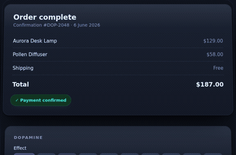<br>**solarbloom** · success | <br>**aurora** · success |
| 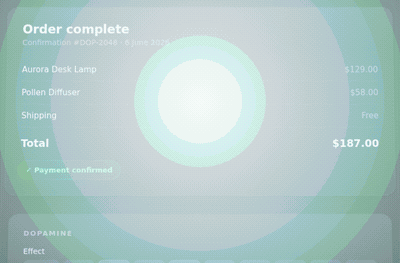<br>**comic** · success | <br>**confetti** · celebration |
| 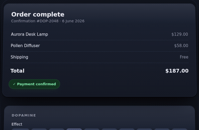<br>**fail** · error | 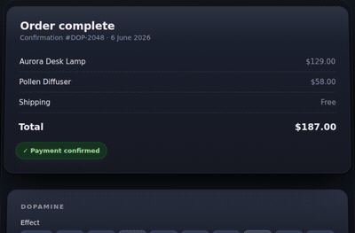<br>**heartburst** · love |
| 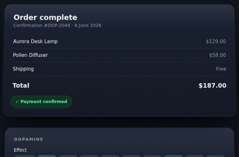<br>**inkstroke** · success | 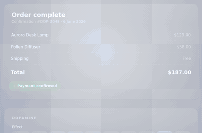<br>**lightning** · power-up |
| 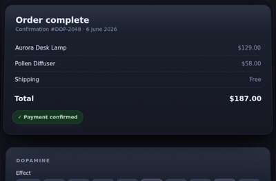<br>**ripple** · success | 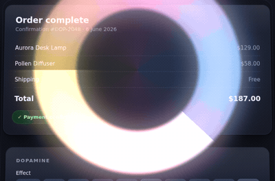<br>**halo** · loading (continuous) |

<details>
<summary>📸 Still frames</summary>

<p>
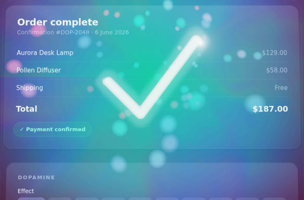
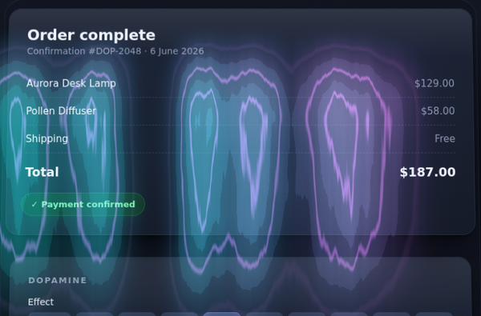
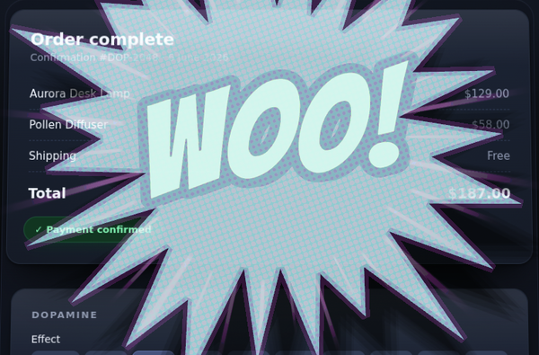
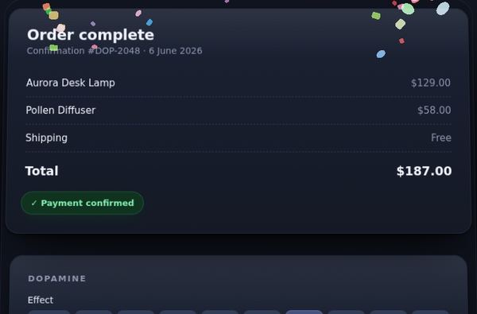
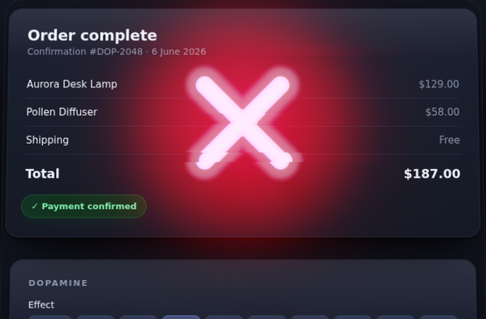
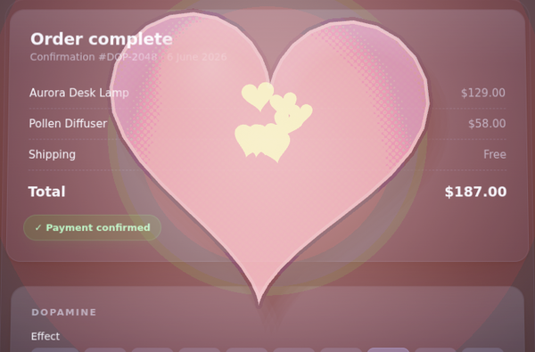
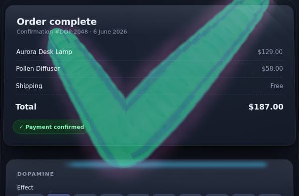
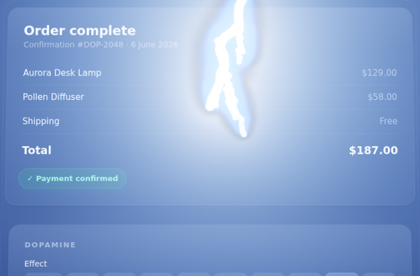
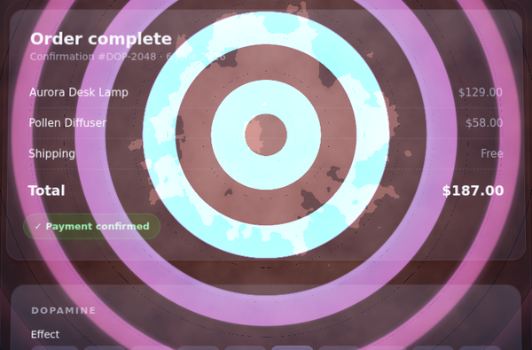
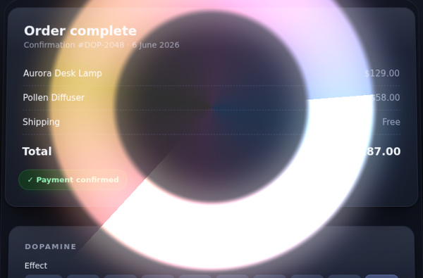
</p>
</details>

## The built-in effects

| Effect | Feeling | What it does |
|---|---|---|
| **solarbloom** | success | a centered radial volumetric bloom — light radiating from a point |
| **aurora** | success | shimmering aurora curtains |
| **comic** | success | a comic-book BAM/POW impact — a hand-lettered affirmation slams in over a jagged starburst (hybrid Canvas2D + WebGL; animated panel, mood display fonts, and full per-letter typography on **all three** platforms) |
| **confetti** | celebration | a launched confetti burst |
| **fail** | error | a stamped-cross failure mark |
| **heartburst** | love / favorite | a lub-dub heart burst (hybrid offscreen panel + shader) |
| **inkstroke** | success | a calligraphic ink-stroke "verdict" signature |
| **lightning** | power-up | a high-energy lightning strike |
| **ripple** | success | concentric water ripples |
| **halo** | loading | a calm ambient ring of light that breathes + sweeps — a CONTINUOUS effect, loops seamlessly |

We plan to add many more and expand the mechanisms in every effect; effects can
also live in other repositories and ship as standalone packages. **All three
stacks ship every built-in effect** from the same `.dope` document
(byte-parity-tested across web, Swift, and Android). The effects are grounded
in research on dopamine reward responses, modern aesthetics, and a sense of
whimsy.

## Repository layout

```
.
├─ packages/                  # WEB monorepo (npm workspaces)
│  ├─ core/                   # @dopamine/core — slim runtime (conductor, registries, .dope loader, pass/panel runners, engine)
│  ├─ effects/                # @dopamine/effects — batteries-included umbrella + <dopamine-success> element
│  └─ react/                  # @dopamine/react — <DopamineSuccess> + useDopamine()
├─ effects/<name>/            # SINGLE-FOLDER effects: one unified .dope + the effect's
│                             #   web/swift/android sources (+ fonts/ if any), compiled by the toolchain
│                             #   into standalone dist/ packages per platform (npm + SwiftPM + Gradle)
├─ tools/dopamine/            # @dopamine/build — `dopamine build` emits installable Swift/npm/Android packages from one folder
├─ examples/demo/             # interactive Vite demo (mood/intensity/whimsy controls) — the live site above
├─ scripts/                   # build/render/reel/media tooling
├─ docs/                      # .dope format spec + schema + authoring guide + README media
├─ swift/                     # SWIFT/Metal port (SwiftPM)
│  ├─ Package.swift           # DopamineCore only — every effect ships as a standalone dist/ SwiftPM package
│  ├─ Sources/DopamineCore/   # shared runtime (mirrors packages/core; Linux-portable behind canImport guards)
│  ├─ Demo/                   # XcodeGen project.yml for the iOS-Simulator demo app (consumes the dist/ packages)
│  └─ Tests/                  # portable + the cross-platform parity suite (effect-agnostic)
├─ android/                   # ANDROID port (Gradle multi-module)
│  ├─ dopamine-core/          # PURE-Kotlin/JVM portable core (mirrors packages/core) + the 192-case parity test — no Android SDK needed
│  ├─ dopamine-gl/            # OpenGL ES 3.0 rendering layer: GLSurfaceView overlay host + generic pass/panel runners
│  ├─ dopamine-effects/       # umbrella that registers every built-in effect (consumes each effect's dist/ module)
│  └─ demo/                   # Android demo app
└─ .github/workflows/         # swift.yml (Metal/iOS CI) + web-reel.yml (reel CI) + android.yml (GL/JVM CI)
```

> **Every effect lives in the single-folder model** (`effects/<name>/`): one
> unified `.dope` + the effect's per-platform sources, built by
> `tools/dopamine` into standalone, installable packages under `dist/` (gitignored)
> — an npm package, a SwiftPM package, and a Gradle library, each embedding a
> byte-identical portable `.dope`. This is how a third-party effect ships, too.

## Quick start — web

```bash
npm install
npm run dev        # interactive demo at localhost
```

Use it in your app — batteries-included (registers every effect):

```ts
import { celebrate } from "@dopamine/effects";
await celebrate({ mood: "celebratory", intensity: 0.8, whimsy: 0.6 });
```

Or pay only for what you import (each effect self-registers):

```ts
import "@dopamine/effect-solarbloom";
import { play } from "@dopamine/core";
await play("solarbloom", { mood: "celebratory", intensity: 0.8 });
```

Declarative element, or React:

```html
<dopamine-success mood="electric" intensity="0.9"></dopamine-success>
```
```tsx
import { DopamineSuccess } from "@dopamine/react";
<DopamineSuccess trigger={orderId} mood="celebratory" intensity={0.8} />;
```

| Option | Default | Meaning |
|---|---|---|
| `mood` | `"celebratory"` | `serene` · `celebratory` · `electric` |
| `intensity` | `0.7` | 0..1 — saturation, brightness, bloom size, overshoot |
| `whimsy` | `0.5` | 0..1 — photoreal ↔ non-photoreal (cel / hand-drawn) stylization |
| `seed` | random | pin for reproducible output |
| `origin` | center | viewport-pixel anchor |
| `target` | `document.body` | element the overlay lights (light + shadow are cast on what's beneath) |

## Quick start — Swift / Metal

```bash
cd swift
swift build          # builds DopamineCore (the shared runtime)
swift test           # portable suites + the cross-platform parity grid
```

`DopamineCore` builds on **Linux with no Apple toolchain** — every
Metal/MetalKit/UIKit type sits behind `#if canImport(Metal)` / `canImport(UIKit)`.
Apple platforms additionally get the Metal overlay host, the shader pass-runner,
and the `.metal` shaders. **Every effect** is emitted by the toolchain
(`node tools/dopamine/src/cli.mjs build`) into a standalone
`dist/swift/DopamineEffect<Name>` SwiftPM package — bundling its `.dope` (+ any
display-face ttf converted from the shared woff2 at build time) and the generated
uniform struct. The iOS demo depends on those `dist/` packages by path.

The iOS demo app is generated by XcodeGen (SwiftPM can't emit an `.app`):

```bash
cd swift/Demo
xcodegen generate
xcodebuild -project DopamineDemo.xcodeproj -scheme DopamineDemo \
  -destination 'platform=iOS Simulator,name=iPhone 16' build
# then: xcrun simctl launch booted ai.polyguard.DopamineDemo -autoplay all
```

## Quick start — Android

```bash
cd android
./gradlew :dopamine-core:test     # the 192-case byte-parity grid (NO Android SDK needed)
./gradlew assembleDebug           # build the GL runtime + effects + the demo APK (needs the SDK)
```

`dopamine-core` is **pure Kotlin/JVM** — it builds + runs the parity grid on a
plain JVM with no Android SDK (the analog of the Swift Linux CI job). The GL
runtime + effect packages + demo are Android-library/app modules (they need the
SDK). Android uses **OpenGL ES 3.0 — GLSL ES 3.00, the same shading language as
WebGL2** — so each effect's single GLSL source serves both stacks and uniforms
bind by name (no Metal-style struct codegen). Fire an effect:

```kotlin
val view = DopamineView(context)               // a translucent overlay
Heartburst.register(context)                    // or Dopamine.registerAll(context)
view.play("heartburst", PlayOptions(mood = "celebratory", intensity = 0.85))
```

See [`android/README.md`](android/README.md) for the architecture + how to port
an effect.

## Reels, recordings & media

Every effect is rendered headlessly so the previews stay honest and reproducible.

- **README media** — the gallery GIFs + still frames above are rendered in
  headless Chromium (WebGL via SwiftShader, no GPU needed) and committed under
  [`docs/media/`](docs/media):
  ```bash
  npm run media        # → docs/media/<effect>.gif + <effect>.png
  ```
- **Web reel** — the same capture stitched into one continuous video:
  ```bash
  npm run build && npm run reel    # → e2e/output/dopamine-suite.mp4
  ```
- **iOS / Android recordings** — the Metal effects on a booted Simulator and the
  GLSL effects on an emulator, screen-recorded in CI (see below).

## CI

| Workflow | Runner(s) | What it does | Artifact |
|---|---|---|---|
| [`web-reel.yml`](.github/workflows/web-reel.yml) | ubuntu | publish the demo to GitHub Pages, then render + stitch the reel | `dopamine-web-reel` → `e2e/output/dopamine-suite.mp4` |
| [`swift.yml`](.github/workflows/swift.yml) | macOS (`macos-15-xlarge`, M2) + ubuntu (`swift:6.0.3`) | macOS: `dopamine build` (incl. woff2→ttf fonts) → `swift build`/`test` (Metal), the **`dopamine build --check` staleness gate**, XcodeGen → build the iOS demo (from the dist/ packages), boot a sim, autoplay every effect, screen-record. Linux: portability build + the 192-case parity suite with no Apple SDK | `solarbloom-sim-clip` (the recorded sequence) |
| [`android.yml`](.github/workflows/android.yml) | ubuntu ×3 | **jvm**: the 192-case parity grid + a `.dope` byte-parity check (every effect's three dist/ embeds identical) on a free runner (no SDK). **build**: install the SDK + `assembleDebug` the GL runtime + effects + demo. **emulator** (best-effort): boot an emulator, autoplay, `screenrecord` a clip | `dopamine-demo-apk`, `dopamine-android-clip` |

> **Note:** the macOS job needs the `macos-15-xlarge` (M2) larger runner and a
> non-zero GitHub Actions spending limit on the owning account. The web-reel and
> the Linux Swift portability job run on standard free runners.

Download artifacts from the **Actions** tab → the latest run → *Artifacts*.

## How it works (short version)

`@dopamine/core` (web), `DopamineCore` (Swift), and `dopamine-core` (Android) are
thin **shared runtimes**; each effect plugs in from its own package with only
what's genuinely per-effect — its **shader**, its **timing**, and its **uniform
config**. Everything else (color, mood model, the `.dope` loader/grammar, the
pass/overlay runners, the PRNG order) is shared and generalized. The stacks stay
byte-identical because they consume the *same* `.dope` document: the
[`tools/dopamine`](tools/dopamine) build toolchain reads each effect's `.dope`
`binding` contract to emit the Swift + Metal uniform structs (and, for effects
that opt in, generates the MSL + Kotlin shader variants from the effect's one
GLSL ES 3.00 source), then compiles the single effect folder into standalone,
installable packages for every platform.

## Authoring effects

**Start at [`docs/README.md`](docs/README.md)** — it routes every task to its
smallest read. The common case (a fully declarative pure-shader effect: one
`.dope` + one GLSL shader, every platform generated) is covered end to end by
the self-sufficient [`docs/authoring-quickstart.md`](docs/authoring-quickstart.md);
the deep dives are [`docs/authoring-effects.md`](docs/authoring-effects.md)
(how-to) and [`docs/effect-format.md`](docs/effect-format.md) (the spec).
See [`CLAUDE.md`](CLAUDE.md) for the full architecture, the generalization
boundary, the parity/staleness gates, and the repo conventions.
